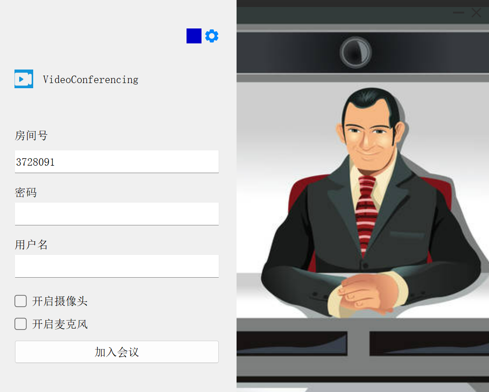
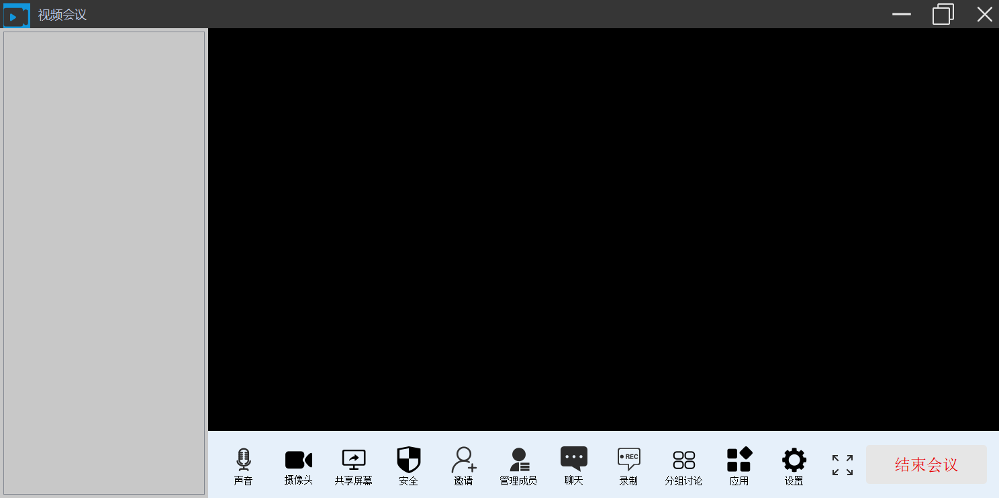

# Videoconferencing

项目使用Windows Qt实现界面设计，调用声网视频SDK实现视频通话、共享桌面功能

## 功能展示




## 克隆仓库
```
git clone https://github.com/Yuruiuu/Videoconferencing.git
```

## 使用指南
环境：visual stodio 2017以上版本，需先安装Qt拓展，使用Qt5版本,32位编译。

将`agora_rtc_sdk\x86`中所有dll文件复制到结局方案Debug目录中。

配置项目属性：

- C/C++ > 常规 > 附加包含目录 > 添加`./agora_rtc_sdk/include`。
- 链接器 > 常规 > 附加库目录 > 添加 `./agora_rtc_sdk/x86`。
- 链接器 > 输入 > 附加依赖项 > 添加 `agora_rtc_sdk.lib`。


从声网控制台获取以下信息：
- App ID：声网随机生成的字符串，用于识别你的项目。
- 临时 Token：Token 也称为动态密钥，在客户端加入频道时对用户鉴权。临时 Token 的有效期为 24 小时


在`CAgoraObject.cpp`中填入你的APPID和TOKEN
```
#define APP_ID     "enter your App id"
#define APP_TOKEN  "enter your temporary token"
```
